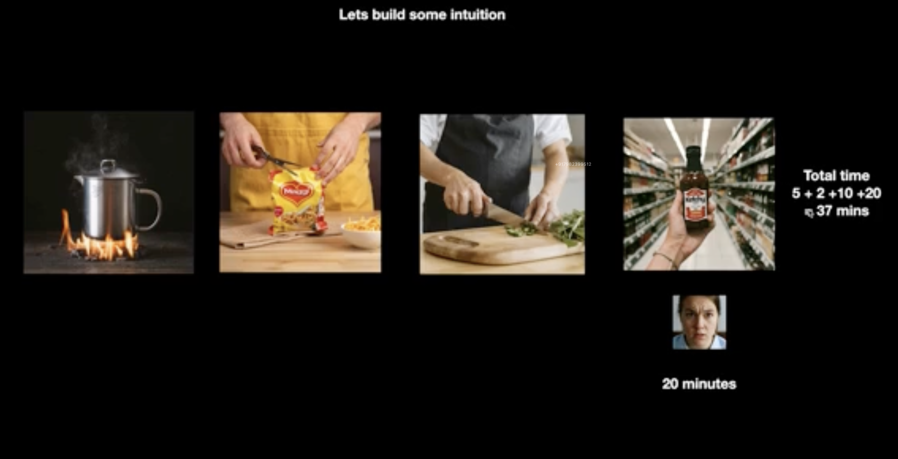
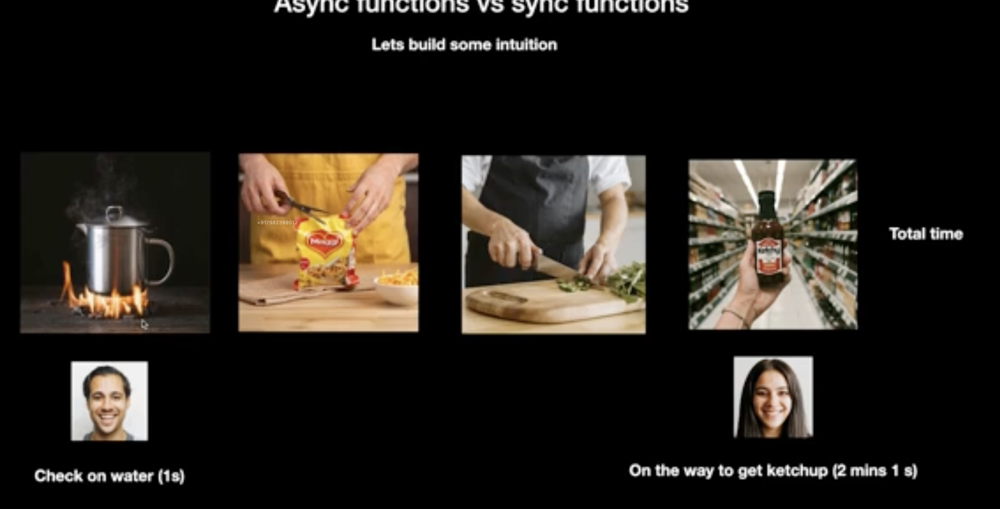
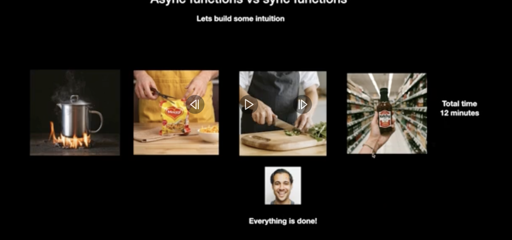
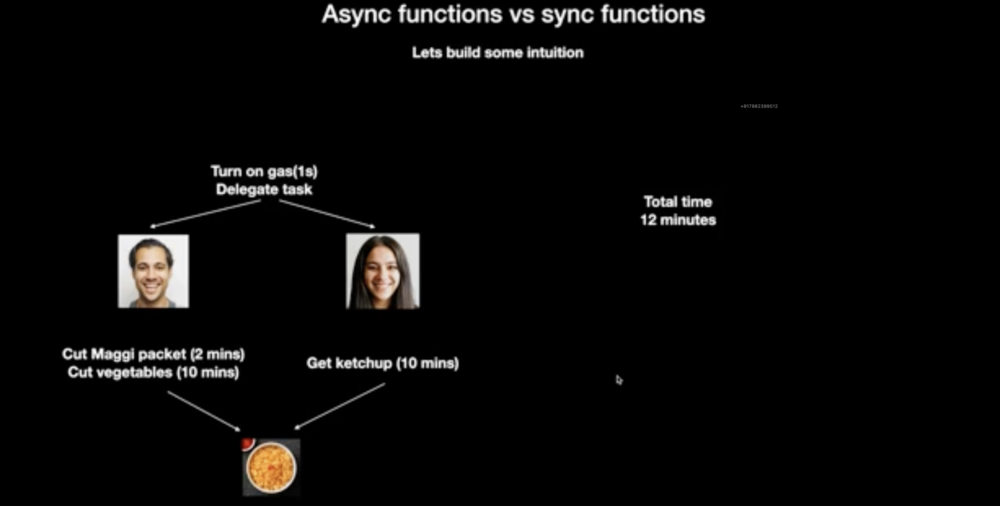
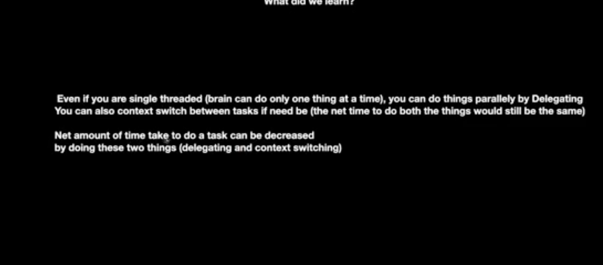
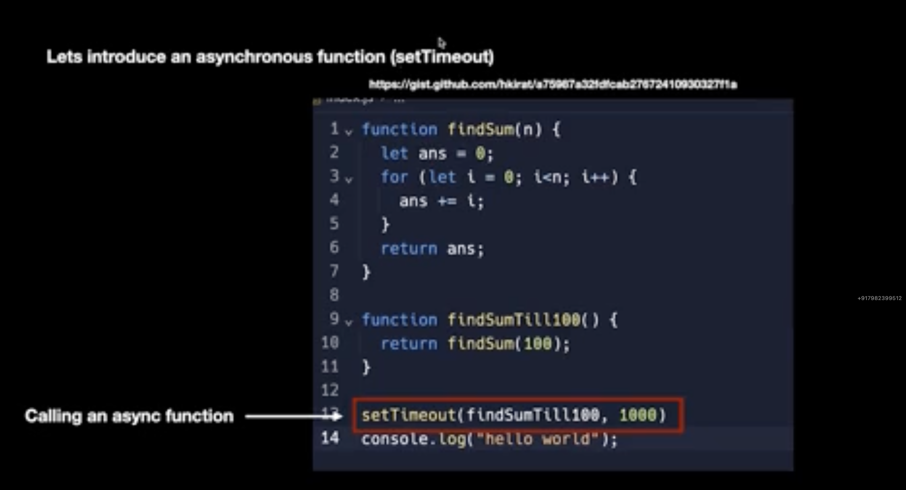
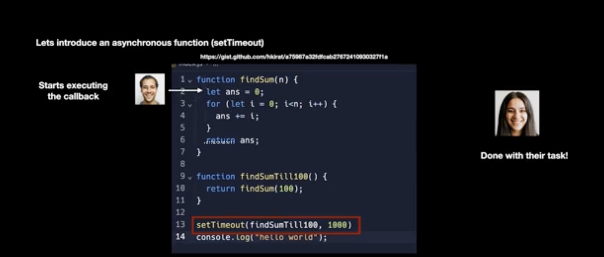
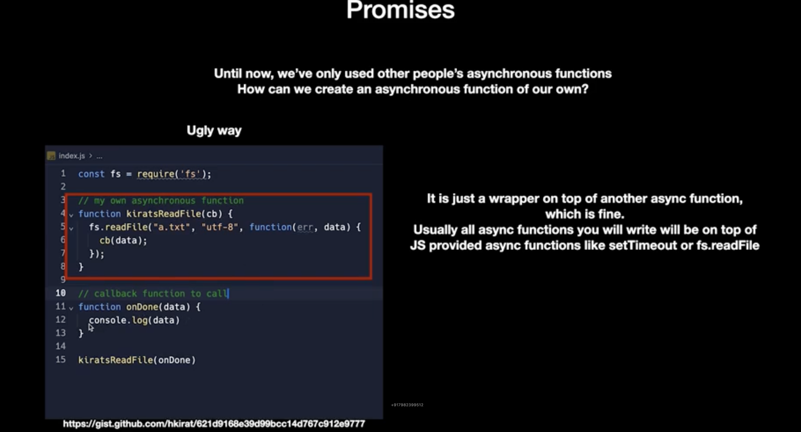
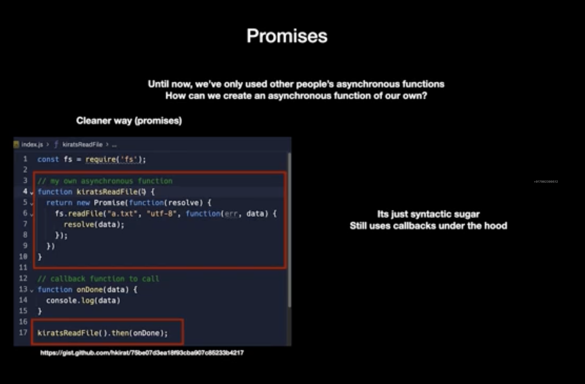

# Async Functions vs Sync Functions

## What does synchronous mean?

### Together , one after the other, sequential

### Only one thing is happening at a time

## What does asynchronous mean?

### Opposite of synchronous, happens in parts.

### Multiple things are context switching with each other

# Human Brain and body is single threaded

# We can only do one thing at a time

# But we can context switch between tasks, or we can delegate tasks to other people

# for example => 4 tasks=>

Boil water
Cut vegetables
cut maggi packets
Get ketchup from the shop nearby

# How would you do this ? Synchronously or Asynchronously

### This women first cooks the water and lets it boil, then cuts the maggi packet, then cuts the vegetables, then goes to the market to get a ketchup

### She is an angry women because all this takes her 37 minutes

### This guy delegates the task to the kamala didi, it took her total a 10 minutes to get the ketchup

### Total time in this case is 12 minutes

# yes by using asynchronous functions

# Promises

const fs = require('fs');

//my own asynchronous function
function kiratsReadFile(cb){
fs.readFile('a.text', 'utf-8', function(err, data){
cb(data)
})
}

//callbackfunction to call
function onDone(data){
console.log(data)
}

kiratsReadFile(onDone)

# In slide11 or the code below as you can see there are no callbacks,instead we use promises

const fs = require('fs')

//my own asynchronous function
function kiratsReadFile(){
return new Promise(function(resolve)){
fs.readFile('a.txt','utf-8',function(err, data){
resolve(data)
})
}
}

function onDone(data){
console.log(data)
}

kiratsReadFile().then(onDone)

# promises have been introduced to avoid the use of callbacks

## It still uses callbacks under the hood
