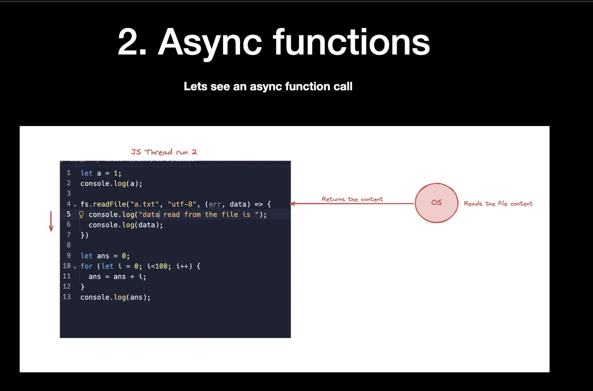

# CALLBACKS

# ASYNC FUNCTIONS

## WHAT IS ASYNC

### Your javascript code dosent have access to everything immediately

### There are some tasks it needs to wait for

### Reading a file

### Sending a network request

### A Dileberate timeout

