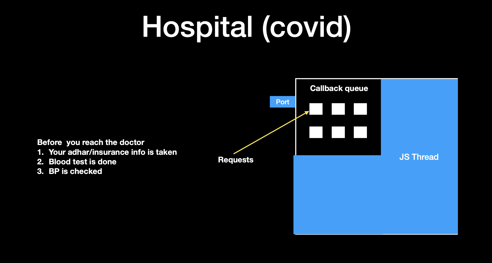
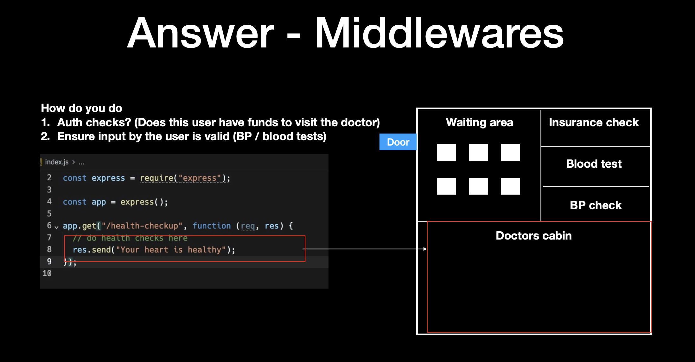

# Middleware, Authentication, Global Caches, and Zod

## What is Middleware?

[](./Images/Slide1.png)

- Imagine a hospital: there is a doctor’s cabin, but the doctor can only attend to **one patient at a time** → single-threaded.
- Before entering the doctor’s cabin, patients must go through **pre-checks**:
  - Waiting area
  - Insurance check
  - Blood test
  - BP check
- A patient cannot enter the doctor’s cabin without completing these steps.

[](./Images/Slide2.png)

👉 Similarly, in JavaScript/Express, these **pre-checks** are called **middleware**, which run before the main request handler.

---

## Example: Express Middleware & Health Check

```javascript
const express = require("express");
const app = express();

// Middleware (example: logging)
app.use((req, res, next) => {
  console.log(`Request received: ${req.method} ${req.url}`);
  next(); // continue to next middleware/route
});

// Health check route
app.get("/health-checkup", (req, res) => {
  res.send("Server is healthy 🚑");
});

// Start the server
app.listen(3000, () => {
  console.log("Server running on http://localhost:3000");
});
```

# HOW DO YOU DO THE AUTH CHECKS (DOES THIS USER HAVE FUNDS TO VISIT THE DOCTER )

# ENSURE INPUT BY USER IS VALID (BP/ BLOOD TESTS)

[](./Images/Slide3.png)

## in real world there are two prechecks that happen

### authentication making sure that the person is logged in or not

### second is input validation (ex username , number and all)

## the route that you are trying to hit whatever input it expects whether you are providing it or not

# Before we proceeed lets add constarints to our route

- 1 User needs to send a KidneyId as a queryparam , which should be a number from 1,2 (humans only has two kidneys)
- 2 User should send a username and password in headers

# ugly way

```javascript
const express = require("express");
const app = express();
// Health check route
app.get("/health-checkup", (req, res) => {
  const kidneyId = req.query.kidneyId;
  const username = req.headers.username;
  const password = req.headers.password;

  if (username != "harkirat" && password != "pass") {
    res.status(400).json({
      msg: "user dosent exist",
    });
    return;
  }
  if (kidneyId != 1 && keidneyId != 2) {
    res.status(400).json({
      msg: "wrong input",
    });
    return;
  }
  res.json({"Server is healthy 🚑"});
});

// Start the server
app.listen(3000, () => {
  console.log("Server running on http://localhost:3000");
});
```

[](./Images/Slide4.png)


# what if i tell you to introduce another route that does kidney replacement
# inputs need to be the same


# ugly solution create a new route repeat the same code

```javascript
const express = require("express");

const app = express();

app.get("/health-checkup",()=>{
  // do health check ups 
  const kidneyId = req.query.kidneyId;
  const username = req.headers.username;
  const password = req.headers.password;

  if(username != "harkirat" && password != "pass"){
    res.status(403).json({
      msg:"user dosent exist"
    })
    return;

  }
if(kidneyId != 1 && kidneyId != 2){
  res.status(411).json({
msg:"wrong input"
  });
  return;
}

res.send("your heart is healthy")
})


// craeting a new route

app.put("/replace-kidney",(req,res)=>{
// do health checkls here
const kidneyId = req.query.kidneyId;
const username = req.query.userrname;
const password = req.query.password;

if(username != "harkirat" && password!="pass"){
  res.status(403).json({
    msg:"User dosent exist"
  })
  return;

}

if(kidneyId != 1 && kidneyId !=2){
  res.status(411).json({
    msg:"wrong input"
  })
  return;
}
// do kidney replacement here 

res.send("your heart is healthy")
})
```

[](./Images/Slide5.png)
# THERE IS A PROBLEM HERE DONT REPEAT YOUR SELF

## Single better solution create a wrapper function


```javascript
const express = require("express");
const app = express();
// Health check route
app.get("/health-checkup", (req, res) => {
  const kidneyId = req.query.kidneyId;
  const username = req.headers.username;
  const password = req.headers.password;

  if (username != "harkirat" && password != "pass") {
    res.status(400).json({
      msg: "user dosent exist",
    });
    return;
  }
  if (kidneyId != 1 && keidneyId != 2) {
    res.status(400).json({
      msg: "wrong input",
    });
    return;
  }
  res.json({"Server is healthy 🚑"});
});

// Start the server
app.listen(3000, () => {
  console.log("Server running on http://localhost:3000");
});
```

[](./Images/Slide4.png)


# what if i tell you to introduce another route that does kidney replacement
# inputs need to be the same


# ugly solution create a new route repeat the same code

```javascript
const express = require("express");

const app = express();

function usernameValidater (){
  if (username != "harkirat" && password != "pass" ){
    return false;

  }
  return true;
}

function kidneyValidator(){
  if(kidneyId != 1 && kidneyId != 2){
    return false
  }
  return true
}
app.get("/health-checkup",()=>{
  // do health check ups 
  const kidneyId = req.query.kidneyId;
  const username = req.headers.username;
  const password = req.headers.password;

  if(!usernameValidator(req.query.username, req.query.password)){
    res.status(403).json({
      msg:"user dosent exist"
    })
    return;

  }
if(!kidneyValidator(kidneyId)){
  res.status(411).json({
msg:"wrong input"
  });
  return;
}

res.send("your heart is healthy")
})


// craeting a new route

app.put("/replace-kidney",(req,res)=>{
// do health checkls here
const kidneyId = req.query.kidneyId;
const username = req.query.userrname;
const password = req.query.password;

if(!usernameValidator(req.query.username, req.query.password)){
    res.status(403).json({
      msg:"user dosent exist"
    })
    return;

  }
if(!kidneyValidator(kidneyId)){
  res.status(411).json({
msg:"wrong input"
  });
  return;
}
// do kidney replacement here 

res.send("your heart is healthy")
})
```


[](./Images/Slide5.png)


# YOU CAN DO AHUNDRED THINGS TO BRING THIS CLOSE TO OPTIMAL

# THE IDEAL SOLUTION OF THIS PROBLEM IS A MIDDLEWARE

```javascript
const express = require("express");

const app = express();

function userMiddleware(req, res, next){
  if(username != "harkirat" && password != "pass"){
    res.status(403).json({
      msg:"Incorrect inputs"
    });
  }else{
    next();
  }
}

function kidneyMiddleware(req, res, next){
  if (kidneyId != 1 && kidneyId != 2){
    res.status(403).json({
      msg:"incorrect inputs"
    })
  }
else{
  next();
}
}

app.get("/health-checkup",userMiddleware, kidneyMiddleware,(req, res)=>{

  res.send("your heart is healthy")

})

app.get("kidney-check", userMiddleware, kidneyMiddleware,(req, res)=>{
res.send("your heart is healthy")
})

app.get("heart-check",userMiddleware,(req,res)=>{
res.send("your heart is healthy")
})

```
[](./Images/Slide6.png)

## i have lied a bit to you 
## you can acctualy use two callback functions

## when i run this request you see an error , WHY?
## thats because we are not doing res.send()


# What is next()?
## this next is just a function itself which you can call if you fell everything is fine
## this is how express lets you chain through middlewares 


# EXAMPLE

## CALCULATE REQUESTS(LOAD ON THE SERVER)


## LAST THING IN MIDDLEWARE - APP.USE()


## USE MEANS THIS MIDDLEWARE WILL BE CALLED EVERYWHERE


## APP.USE() TAKES A MIDDLEWARE AS AN INPUT

EXPRESS.JSON()

# WHY DO YOU NEED INPUT VALIDATION