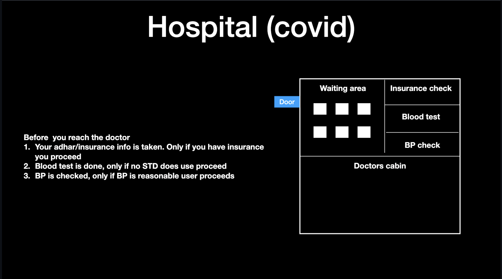
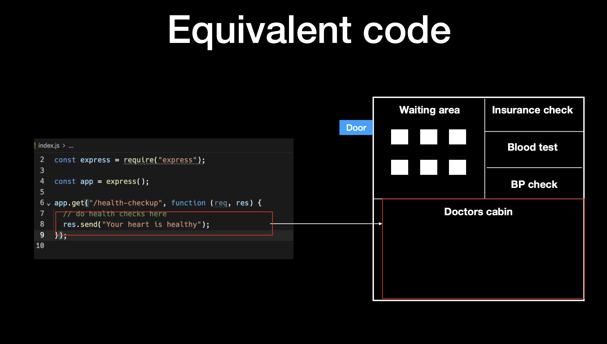
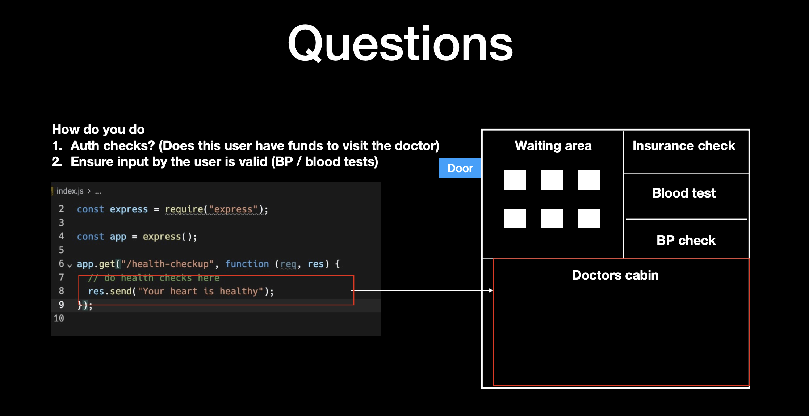

# Middleware, Authentication, Global Caches, and Zod

## 📑 Table of Contents

1. [What is Middleware?](#-what-is-middleware)
2. [Example: Express Middleware & Health Check](#️-example-express-middleware--health-check)
3. [Authentication & Input Validation](#-authentication--input-validation)
4. [Adding Constraints to a Route](#-adding-constraints-to-a-route)
5. [The DRY Problem](#️-the-dry-problem-dont-repeat-yourself)
6. [Better Way: Wrapper Functions](#-better-way-wrapper-functions)
7. [Ideal Solution: Middleware](#-ideal-solution-middleware)
8. [Understanding next()](#-understanding-next)
9. [Example: Counting Requests](#-example-counting-requests-middleware-use-case)
10. [Global Middleware with app.use()](#-global-middleware-with-appuse)
11. [The Need for Error Handling](#️-the-need-for-error-handling)
12. [Global Error Handling Middleware](#️-global-error-handling-middleware)
13. [Why Input Validation?](#-why-input-validation)
14. [Zod for Input Validation](#-zod-for-input-validation)
15. [Example: Zod Schema](#-example-zod-schema)
16. [Combining Zod with Middleware](#-combining-zod-with-middleware)
17. [Summary](#-summary)

---

## 📌 What is Middleware?

[](./Images/Slide1.png)

Imagine a hospital:

- The **doctor’s cabin** = Main application logic.
- The **doctor** can only attend **one patient at a time** → single-threaded.
- Before entering the doctor’s cabin, patients must go through **pre-checks**:
  - Waiting area
  - Insurance check
  - Blood test
  - BP check

👉 Similarly, in **Express/JavaScript**, these pre-checks are called **middleware**.  
They run **before the main route handler**.

[](./Images/Slide2.png)

---

## ⚙️ Example: Express Middleware & Health Check

```js
const express = require("express");
const app = express();

app.get("/health-checkup", function (req, res) {
  res.send("your heart is healthy");
});
```

[](./Images/Slide4.png)

## 🔑 Authentication & Input Validation

In the real world, two pre-checks are common:

- Authentication → Is the user logged in?

- Input Validation → Are the inputs valid? (e.g., username, password, etc.)

## 🚑 Adding Constraints to a Route

- User must send a kidneyId as a query param (1 or 2, since humans only have 2 kidneys).

- User must send username and password in headers.
  ❌ Ugly Way

```js
const express = require("express");
const app = express();
// Health check route
app.get("/health-checkup", (req, res) => {
  const kidneyId = req.query.kidneyId;
  const username = req.headers.username;
  const password = req.headers.password;

  if (username != "harkirat" && password != "pass") {
    res.status(400).json({
      msg: "user dosent exist",
    });
    return;
  }
  if (kidneyId != 1 && keidneyId != 2) {
    res.status(400).json({
      msg: "wrong input",
    });
    return;
  }
  //do something with the kidney here
  res.json({"Server is healthy 🚑"});
});


```

[](./Images/Slide4.png)

## ⚠️ The DRY Problem (Don’t Repeat Yourself)

# what if i tell you to introduce another route that does kidney replacement

# inputs need to be the same

# ugly solution create a new route repeat the same code

When we add multiple routes, we start repeating the same checks.
This makes the code messy and unmaintainable.

```javascript
const express = require("express");

const app = express();

app.get("/health-checkup", () => {
  // do health check ups
  const kidneyId = req.query.kidneyId;
  const username = req.headers.username;
  const password = req.headers.password;

  if (username != "harkirat" && password != "pass") {
    res.status(403).json({
      msg: "user dosent exist",
    });
    return;
  }
  if (kidneyId != 1 && kidneyId != 2) {
    res.status(411).json({
      msg: "wrong input",
    });
    return;
  }

  res.send("your heart is healthy");
});

// craeting a new route

app.put("/replace-kidney", (req, res) => {
  // do health checkls here
  const kidneyId = req.query.kidneyId;
  const username = req.query.userrname;
  const password = req.query.password;

  if (username != "harkirat" && password != "pass") {
    res.status(403).json({
      msg: "User dosent exist",
    });
    return;
  }

  if (kidneyId != 1 && kidneyId != 2) {
    res.status(411).json({
      msg: "wrong input",
    });
    return;
  }
  // do kidney replacement here

  res.send("your heart is healthy");
});
```

[](./Images/Slide5.png)

## ✅ Better Way: Wrapper Functions

When we add multiple routes, we start repeating the same checks.
This makes the code messy and unmaintainable.

# what if i tell you to introduce another route that does kidney replacement

# inputs need to be the same

# ugly solution create a new route repeat the same code

```javascript
const express = require("express");

const app = express();

function usernameValidater() {
  if (username != "harkirat" && password != "pass") {
    return false;
  }
  return true;
}

function kidneyValidator() {
  if (kidneyId != 1 && kidneyId != 2) {
    return false;
  }
  return true;
}
```

👉 Slightly better, but still repetitive across routes.

## 🚀 Ideal Solution: Middleware

```js
function userMiddleware(req, res, next) {
const { username, password } = req.headers;
if (username !== "harkirat" || password !== "pass") {
return res.status(403).json({ msg: "Incorrect inputs" });
}
next();
}

function kidneyMiddleware(req, res, next) {
const { kidneyId } = req.query;
if (kidneyId != 1 && kidneyId != 2) {
return res.status(403).json({ msg: "Incorrect kidneyId" });
}
next();
}

app.get("/health-checkup", userMiddleware, kidneyMiddleware, (req, res) => {
res.send("Your heart is healthy ❤️");
});
```
## 🔄 Understanding next()

- next() lets Express know the middleware finished its job.

- Without next(), the request never reaches the route handler.

## 📊 Example: Counting Requests (Middleware Use Case)

```js
Copy code
let requestCount = 0;

app.use((req, res, next) => {
requestCount++;
console.log("Total requests so far:", requestCount);
next();
});

app.get("/", (req, res) => res.send("Hello World"));
```
## 🌍 Global Middleware with app.use()

- app.use() applies middleware to all routes.

- Example: express.json() parses JSON automatically.

js
Copy code
app.use(express.json());
⚠️ The Need for Error Handling

Without global catches, one small bug (like dividing by zero) can crash the server.

🛡️ Global Error Handling Middleware

Express lets you define a special middleware with 4 params:

js
Copy code
app.use((err, req, res, next) => {
console.error(err.stack);
res.status(500).json({ msg: "Something went wrong!" });
});
👉 This ensures the server doesn’t crash on errors.

📏 Why Input Validation?

Prevent invalid requests from reaching logic.

Protect against crashes and bad data.

Example: missing username, invalid kidneyId, etc.

🧰 Zod for Input Validation

Zod is a TypeScript-first validation library.
It allows you to define schemas and validate incoming data easily.

✅ Example: Zod Schema

js
Copy code
const { z } = require("zod");

const userSchema = z.object({
username: z.string(),
password: z.string(),
kidneyId: z.number().min(1).max(2),
});

// Example validation
app.post("/validate", (req, res) => {
const result = userSchema.safeParse(req.body);
if (!result.success) {
return res.status(400).json({ msg: "Invalid input", errors: result.error });
}
res.json({ msg: "Validation passed ✅" });
});
🛡️ Combining Zod with Middleware

js
Copy code
function validateUser(req, res, next) {
const result = userSchema.safeParse(req.body);
if (!result.success) {
return res.status(400).json({ msg: "Invalid input", errors: result.error });
}
next();
}

app.post("/checkup", validateUser, (req, res) => {
res.send("Checkup completed ✅");
});
📚 Summary
Middleware = pre-checks before route logic.

Authentication = checks if the user is allowed.

Validation = ensures inputs are valid.

Global Catches = prevent server crashes.

Zod = simplifies validation with schemas.

```

```
