# Middleware, Authentication, Global Caches, and Zod

## 📑 Table of Contents

1. [What is Middleware?](#-what-is-middleware)
2. [Example: Express Middleware & Health Check](#️-example-express-middleware--health-check)
3. [Authentication & Input Validation](#-authentication--input-validation)
4. [Adding Constraints to a Route](#-adding-constraints-to-a-route)
5. [The DRY Problem](#️-the-dry-problem-dont-repeat-yourself)
6. [Better Way: Wrapper Functions](#-better-way-wrapper-functions)
7. [Ideal Solution: Middleware](#-ideal-solution-middleware)
8. [Understanding next()](#-understanding-next)
9. [Difference between res.send() and res.json()](#-difference-between-ressend-and-resjson)
10. [Importance of app.use(express.json())](#-importance-of-appuseexpressjson)
11. [Middleware and req.body](#-middleware-and-reqbody)
12. [3 Ways of Sending input to a Response](#-3-ways-of-sending-input-to-a-response)
13. [Example: Counting Requests](#-example-counting-requests-middleware-use-case)
14. [Why Input Validation?](#-why-input-validation)
15. [The Need for Error Handling](#️-the-need-for-error-handling)
16. [Global Error Handling Middleware](#️-global-error-handling-middleware)
17. [Zod for Input Validation](#-zod-for-input-validation)
18. [Example: Zod Schema](#-example-zod-schema)
19. [Combining Zod with Middleware](#-combining-zod-with-middleware)
20. [Summary](#-summary)

---

## 📌 What is Middleware?

[](./Images/Slide1.png)

Imagine a hospital:

- The **doctor’s cabin** = Main application logic.
- The **doctor** can only attend **one patient at a time** → single-threaded.
- Before entering the doctor’s cabin, patients must go through **pre-checks**:
  - Waiting area
  - Insurance check
  - Blood test
  - BP check

👉 Similarly, in **Express/JavaScript**, these pre-checks are called **middleware**.  
They run **before the main route handler**.

[](./Images/Slide2.png)
[](./Images/Slide3.png)

---

## ⚙️ Example: Express Middleware & Health Check

```js
const express = require("express");
const app = express();

app.get("/health-checkup", function (req, res) {
  res.send("your heart is healthy");
});
```

[](./Images/Slide4.png)
[](./Images/Slide5.png)
[](./Images/Slide6.png)

## 🔑 Authentication & Input Validation

In the real world, two pre-checks are common:

- Authentication → Is the user logged in?

- Input Validation → Are the inputs valid? (e.g., username, password, etc.)

## 🚑 Adding Constraints to a Route

[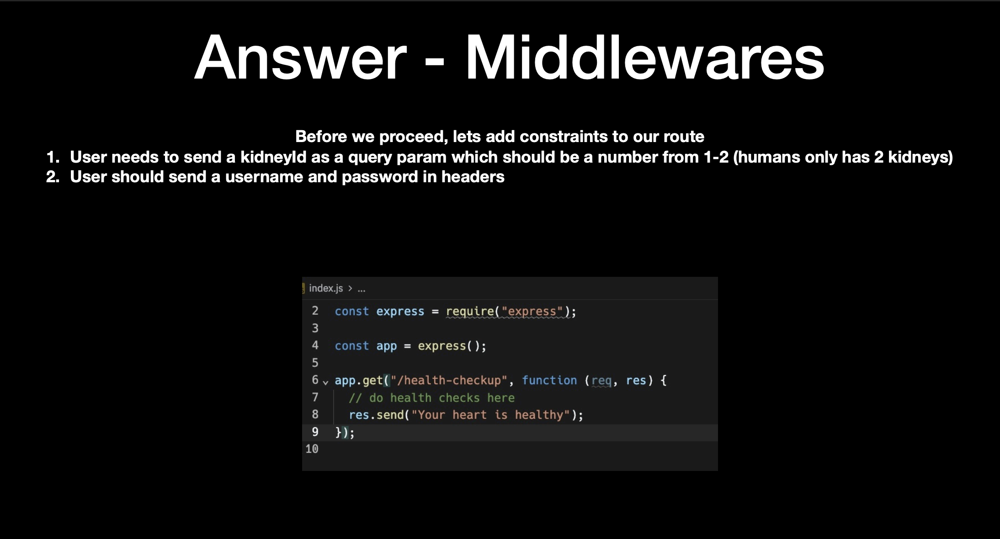](./Images/Slide7.png)

- User must send a kidneyId as a query param (1 or 2, since humans only have 2 kidneys).

- User must send username and password in headers.
  [](./Images/Slide8.png)
  [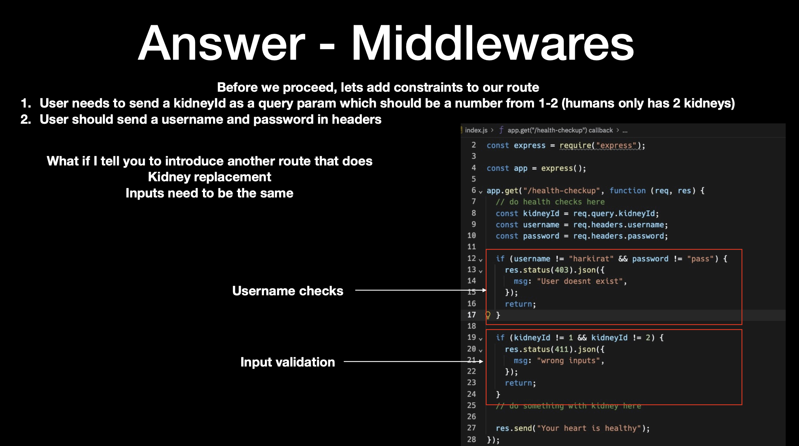](./Images/Slide9.png)
  ❌ Ugly Way

```js
const express = require("express");
const app = express();
// Health check route
app.get("/health-checkup", (req, res) => {
  const kidneyId = req.query.kidneyId;
  const username = req.headers.username;
  const password = req.headers.password;

  if (username != "harkirat" && password != "pass") {
    res.status(400).json({
      msg: "user dosent exist",
    });
    return;
  }
  if (kidneyId != 1 && keidneyId != 2) {
    res.status(400).json({
      msg: "wrong input",
    });
    return;
  }
  //do something with the kidney here
  res.json({"Server is healthy 🚑"});
});


```

[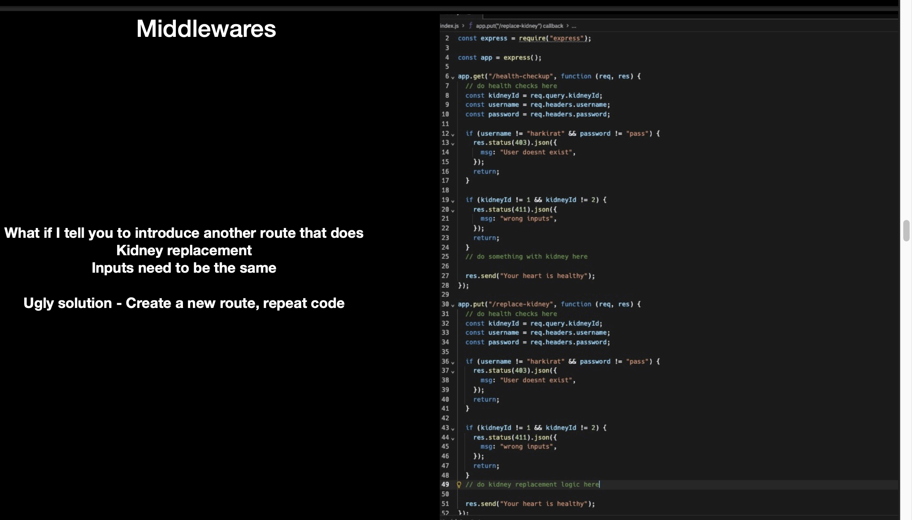](./Images/Slide10.png)
[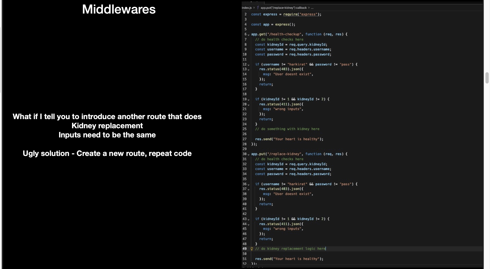](./Images/Slide11.png)

## ⚠️ The DRY Problem (Don’t Repeat Yourself)

# what if i tell you to introduce another route that does kidney replacement

# inputs need to be the same

# ugly solution create a new route repeat the same code

When we add multiple routes, we start repeating the same checks.
This makes the code messy and unmaintainable.

```javascript
const express = require("express");

const app = express();

app.get("/health-checkup", () => {
  // do health check ups
  const kidneyId = req.query.kidneyId;
  const username = req.headers.username;
  const password = req.headers.password;

  if (username != "harkirat" && password != "pass") {
    res.status(403).json({
      msg: "user dosent exist",
    });
    return;
  }
  if (kidneyId != 1 && kidneyId != 2) {
    res.status(411).json({
      msg: "wrong input",
    });
    return;
  }

  res.send("your heart is healthy");
});

// craeting a new route

app.put("/replace-kidney", (req, res) => {
  // do health checkls here
  const kidneyId = req.query.kidneyId;
  const username = req.query.userrname;
  const password = req.query.password;

  if (username != "harkirat" && password != "pass") {
    res.status(403).json({
      msg: "User dosent exist",
    });
    return;
  }

  if (kidneyId != 1 && kidneyId != 2) {
    res.status(411).json({
      msg: "wrong input",
    });
    return;
  }
  // do kidney replacement here

  res.send("your heart is healthy");
});
```

## ✅ Better Way: Wrapper Functions

[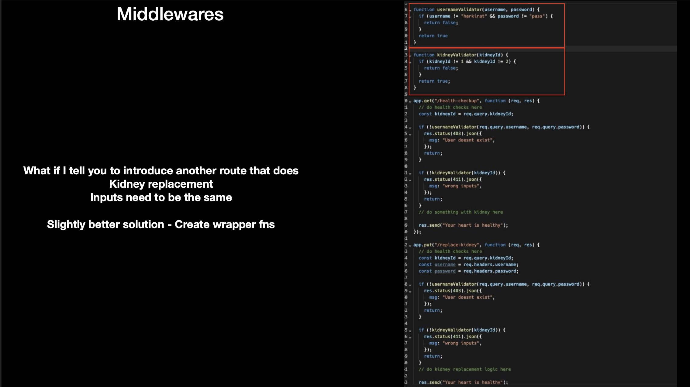](./Images/Slide12.png)

- When we add multiple routes, we start repeating the same checks.
- This makes the code messy and unmaintainable.

# what if i tell you to introduce another route that does kidney replacement

# inputs need to be the same

# ugly solution create a new route repeat the same code

```javascript
const express = require("express");

const app = express();

function usernameValidater() {
  if (username != "harkirat" && password != "pass") {
    return false;
  }
  return true;
}

function kidneyValidator() {
  if (kidneyId != 1 && kidneyId != 2) {
    return false;
  }
  return true;
}
```

👉 Slightly better, but still repetitive across routes.

## 🚀 Ideal Solution: Middleware

[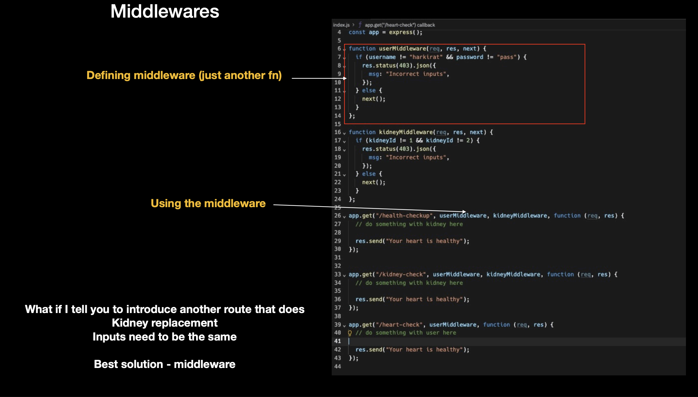](./Images/Slide13.png)
[](./Images/Slide14.png)

```js
function userMiddleware(req, res, next) {
  const { username, password } = req.headers;
  if (username !== "harkirat" || password !== "pass") {
    return res.status(403).json({ msg: "Incorrect inputs" });
  }
  next();
}

function kidneyMiddleware(req, res, next) {
  const { kidneyId } = req.query;
  if (kidneyId != 1 && kidneyId != 2) {
    return res.status(403).json({ msg: "Incorrect kidneyId" });
  }
  next();
}
// you can even give two callback functions

app.get("/health-checkup", userMiddleware, kidneyMiddleware, (req, res) => {
  res.send("Your heart is healthy ❤️");
});
```

## 🔄 Understanding next()

- next() lets Express know the middleware finished its job.
- next() is called when everything is correct.
- Without next(), the request never reaches the route handler.

## 🔍 Difference between res.send() and res.json()

-

## 📦 Importance of app.use(express.json())

[](./Images/Slide14.png)

- app.use() applies middleware to all routes.
- if i know a middleware that will be used in every route i will call app.use()

### IT IS A MIDDLEWARE THAT PARSES INCOMING JSON PAYLOADS IN THE REQUEST BODY

### IT IS CRUCIAL WHILE DEALING WHEN DEALING WITH JSON DATA SENT IN REQUEST BODY , TYPICALLY IN PUT OR POST REQUESTS

### WITHOUT THIS MIDDLEWARE , YOU MIGHT NOT RECEIVE THE JSON DATA AS A RAW STRING , AND YOU NEED TO MANUALLY PARSE IT

- Example: express.json() parses JSON automatically.

```js
const express = require("express");
const app = express()


app.use(express.json();)// Middleware to parse json in the request body

app.post("/",(req, res)=>{
  const jsonData = req.body;
  // now req.body contains the parsed json data
  // process the data

  res.json({success:true});
})
```

## 📝 Middleware and req.body

- req.query and req.headers dont require middleware because the represent the query parameters and headers of the incoming request , respectively. Express automatically parses them.

- req.body requires middlewares like express.json() to parse the request body especially when the body contains JSON data . Other middlewares like express.urlencoded() is used for prasing from data in the request body.

- Middleware helps in processing the request at different stages and is essential for tasks like parsing , logging , authentication and more in a more modular and organized way

  95 9# `# 🔹 3 Ways of Sending input to a Response

### Query Parameter:

### Body

### Headers

## 📊 Example: Counting Requests (Middleware Use Case)

[](./Images/Slide15.png)

```js
let numberOfRequests = 0;
calculateRequests = (req, res, next) => {
  numberOfRequests++;
  console.log("Total request so far", numberOfRequests);
  next();
};
app.use(calculateRequests);
// everytime this route is called the CALCULLATEREQUESTS middleware will be called
app.get("/", (req, res) => res.send("Hello World"));
```

## 📏 Why Input Validation?

[](./Images/Slide17.png)

Prevent invalid requests from reaching logic.

Protect against crashes and bad data.

Example: missing username, invalid kidneyId, etc.

```js
const express = require("express");

const app = express();

app.post("/health-checkup", function (req, res, next) {
  const kidneys = req.body.kidneys;
  const kidneysLength = req.body.kidneys.length;

  res.send("you have" + kidneysLength + "kidneys");
});

app.listen(3000);
```

## ⚠️ The Need for Error Handling

[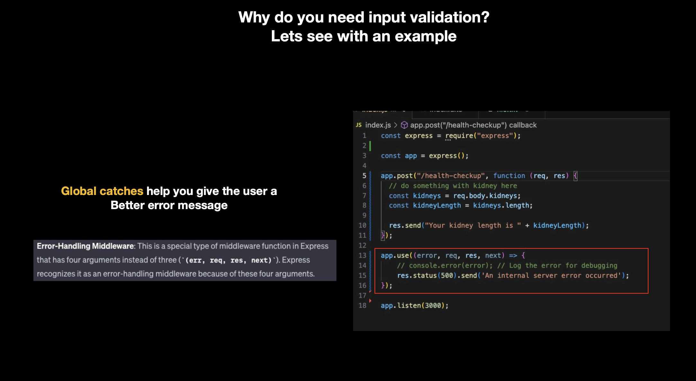](./Images/Slide18.png)

- Without global catches, one small bug (like dividing by zero) can crash the server.

## 🛡️ Global Error Handling Middleware

- This is a special type of midlleware function in Express that has four arguments instead of three `(err, req, res, next)`
  [](./Images/Slide18.png)
  [](./Images/Slide19.png)
- Express lets you define a special middleware with 4 params:

```js
//Global caches
app.use(function (err, req, res, next) {
  res.json({
    msg: "Sorry something is up with our server",
  });
});
```

[](./Images/Slide19.png)

## 🧰 Zod for Input Validation

[](./Images/Slide20.png)
[](./Images/Slide21.png)

- Zod is a TypeScript-first validation library.
- It allows you to define schemas and validate incoming data easily.

```js
const app = express();
app.use(express.json());
```

## ✅ Example: Zod Schema

[](./Images/Slide22.png)
[](./Images/Slide23.png)
[](./Images/Slide24.png)
[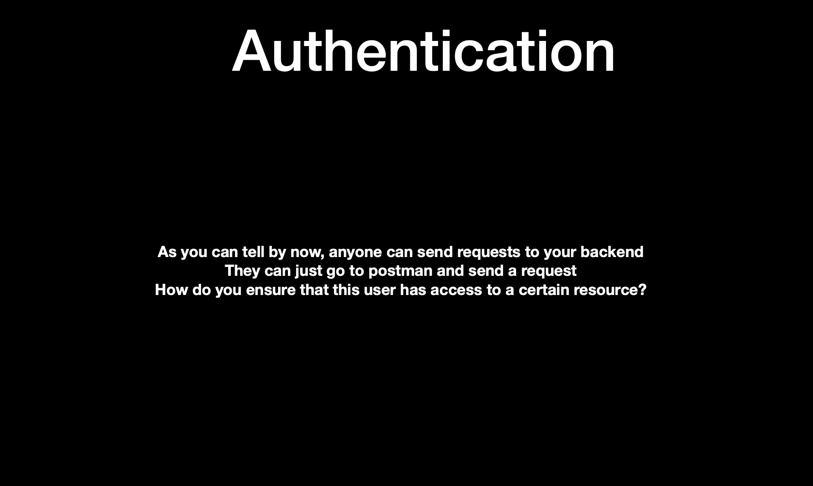](./Images/Slide25.png)

```js
const app = express();
app.use(express.json());
```

## 🛡️ Combining Zod with Middleware

[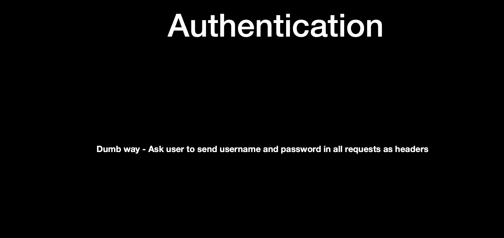](./Images/Slide26.png)
[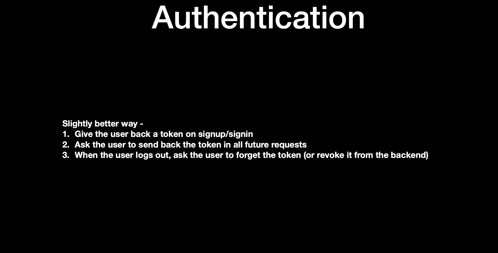](./Images/Slide27.png)
[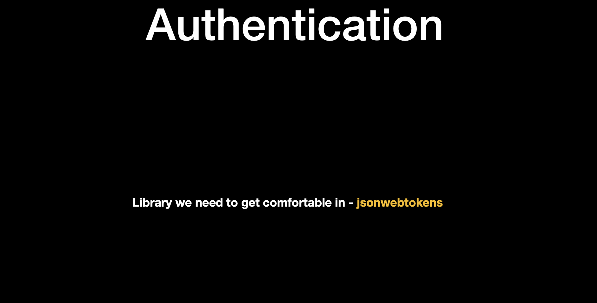](./Images/Slide28.png)

```js
const app = express();
app.use(express.json());
```

## 📚 Summary

Middleware = pre-checks before route logic.

Authentication = checks if the user is allowed.

Validation = ensures inputs are valid.

Global Catches = prevent server crashes.

Zod = simplifies validation with schemas.

```

```

```

```
