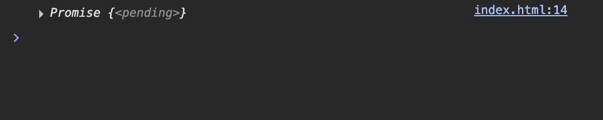
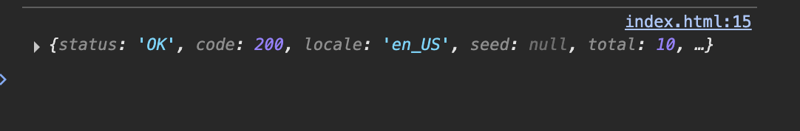
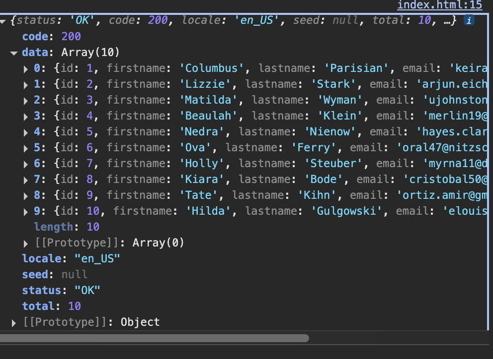

# 📑 JavaScript, Authentication, and Databases Notes

This document covers **asynchronous concepts in JavaScript**, **authentication methods**, and **databases** (with a focus on MongoDB).

---

# 📑 JavaScript, Authentication, and Databases Notes

This document covers **asynchronous concepts in JavaScript**, **authentication methods**, and **databases** (with a focus on MongoDB).

---

## 📌 Table of Contents

1. [fetch() Method](#-fetch-method)
2. [Asynchronous Concepts](#-asynchronous-concepts)
   - [Callback Functions](#1-callback-functions)
     - [Basic Callback Example](#-basic-callback-example)
   - [Promises](#2-promises)
   - [Async/Await](#3-asyncawait)
   - [Try-Catch Blocks](#4-try-catch-blocks)
3. [Authentication](#-authentication)
   - [Hashing](#1-hashing)
   - [Encryption](#2-encryption)
   - [JSON Web Tokens (JWT)](#3-json-web-tokens-jwt)
   - [Local Storage](#4-local-storage)
   - [Authorization Header](#5-authorization-header)
   - [Cookies vs. Local Storage](#6-cookies-vs-local-storage-for-storing-jwt-tokens)
4. [fetch() vs axios()](#-fetch-vs-axios)
5. [Databases](#-databases)
   - [Types of Databazses](#types-of-databases)
   - [MongoDB](#mongodb)zˀ
   - [Creating a Free MongoDB Instance](#creating-a-free-mongodb-instance)
 zaxs   - [How  qa  Does the Backend Connect to the Database?](#how-does-the-backend-connect-to-the-database)
   - [Mongoose](#mongoose)

## 🚀 fetch() Method

The `fetch()` method in JavaScript is used to make HTTP requests.  
It returns a **Promise** that resolves to the `Response` object.

```html
<!DOCTYPE html>
<html>
  <head>
    <meta charset="utf-8" />
    <meta name="viewport" content="width=device-width" />
    <title>replit</title>
    <link href="style.css" rel="stylesheet" type="text/css" />
  </head>

  <body>
    <script>
      function getPersonData() {
        fetch("https://fakerapi.it/api/v1/persons").then((response) => {
          // response.json lets you log data in the json format
          console.log(response.json());
        });
      }
    </script>
    <button onclick="getPersonData()">Click me</button>
  </body>
</html>
```

[](./Images/Promise-Pending.png)

```html
<!DOCTYPE html>
<html>
  <head>
    <meta charset="utf-8" />
    <meta name="viewport" content="width=device-width" />
    <title>Replit</title>
  </head>

  <body>
    <script>
      function getPersonData() {
        fetch("https://fakerapi.it/api/v1/persons")
          .then((response) => response.json()) // convert to JSON
          .then((data) => {
            console.log(data); // log the actual data
          });
      }
    </script>

    <button onclick="getPersonData()">Click me</button>
  </body>
</html>
```

[](./Images/Promise-fullfilled.png)

[](./Images/data.png)

## ⚡ Asynchronous Concepts

### 1. Callback Functions

#### 🔹 Basic Callback Example

Example

```js
function fetchData(callback) { setTimeout(() => { const message =
"Data received!"; callback(message); }, 2000); } fetchData((msg) =>
console.log(msg)); ### 2. Promises `js const

```

### 3. Async/Await

```js

const
```

### 4. Try-Catch Blocks

```js

const
```

## 🔐 Authentication

### 1. Hashing

```js

const
```

### 2. Encryption

```js

const
```

### 3. JSON Web Tokens (JWT)

```js

const
```

### 4. Local Storage

```js

const
```

### 5. Authorization Header

```js

const
```

### 6. Cookies vs. Local Storage

```js

const
```

## 🔄 fetch() vs axios()

## 💾 Databases

```

```
