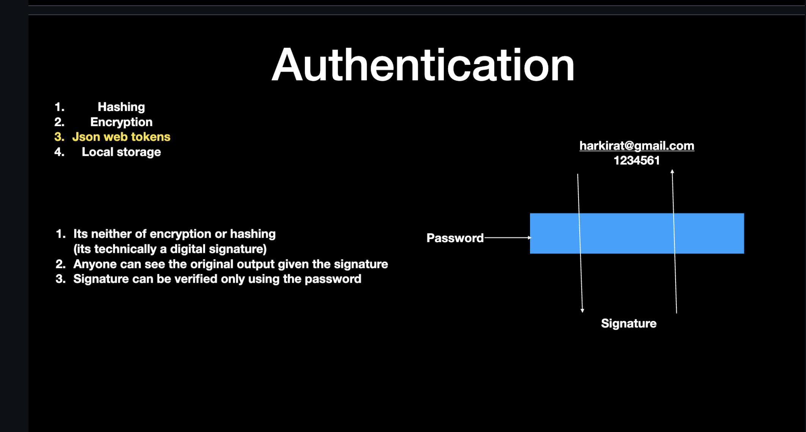

# 📑 JavaScript, Authentication, and Databases Notes

This document covers **asynchronous concepts in JavaScript**, **authentication methods**, and **databases** (with a focus on MongoDB).

---

# 📑 JavaScript, Authentication, and Databases Notes

This document covers **asynchronous concepts in JavaScript**, **authentication methods**, and **databases** (with a focus on MongoDB).

---

## 📌 Table of Contents

1. [fetch() Method](#-fetch-method)
2. [Asynchronous Concepts](#-asynchronous-concepts)
   - [Callback Functions](#1-callback-functions)
     - [Basic Callback Example](#-basic-callback-example)
   - [Promises](#2-promises)
   - [Async/Await](#3-asyncawait)
   - [Try-Catch Blocks](#4-try-catch-blocks)
3. [Authentication](#-authentication)
   - [Hashing](#1-hashing)
   - [Encryption](#2-encryption)
   - [JSON Web Tokens (JWT)](#3-json-web-tokens-jwt)
     - [Token Creation (`jwt.sign`)](#-token-creation-jwtsign)
     - [Decoding (Anyone can do it)](#-decoding-anyone-can-do-it)
     - [Verification (Only backend can do it)](#-verification-only-backend-can-do-it)
   - [Local Storage](#local-storage)
     - [Where Is The Token Stored](#-where-is-the-token-stored)
     - [Lets Start By Creating The Assignment](#-lets-start-by-creating-the-assignment)
   - [Authorization Header](#authorization-header)
   - [Cookies vs. Local Storage](#cookies-vs-local-storage)
4. [fetch() vs axios()](#fetch-vs-axios)
5. [Databases](#databases)
   - [Types of Databases](#types-of-databases)
   - [MongoDB](#mongodb)
   - [Creating a Free MongoDB Instance](#creating-a-free-mongodb-instance)
   - [How Does the Backend Connect to the Database?](#how-does-the-backend-connect-to-the-database)
   - [Mongoose](#mongoose)

## 🚀 fetch() Method

[](./Images/Slide1.png)
[](./Images/Slide2.png)
[](./Images/Slide3.png)
[](./Images/Slide4.png)
The `fetch()` method in JavaScript is used to make HTTP requests.  
It returns a **Promise** that resolves to the `Response` object.

```html
<!DOCTYPE html>
<html>
  <head>
    <meta charset="utf-8" />
    <meta name="viewport" content="width=device-width" />
    <title>replit</title>
    <link href="style.css" rel="stylesheet" type="text/css" />
  </head>

  <body>
    <script>
      function getPersonData() {
        fetch("https://fakerapi.it/api/v1/persons").then((response) => {
          // response.json lets you log data in the json format
          console.log(response.json());
        });
      }
    </script>
    <button onclick="getPersonData()">Click me</button>
  </body>
</html>
```

[](./Images/Promise-Pending.png)

```html
<!DOCTYPE html>
<html>
  <head>
    <meta charset="utf-8" />
    <meta name="viewport" content="width=device-width" />
    <title>Replit</title>
  </head>

  <body>
    <script>
      function getPersonData() {
        fetch("https://fakerapi.it/api/v1/persons")
          .then((response) => response.json()) // convert to JSON
          .then((data) => {
            console.log(data); // log the actual data
          });
      }
    </script>

    <button onclick="getPersonData()">Click me</button>
  </body>
</html>
```

[](./Images/Promise-fullfilled.png)

[](./Images/data.png)

## ⚡ Asynchronous Concepts

### 1. Callback Functions

#### 🔹 Basic Callback Example

Example

```html
<!DOCTYPE html>
<html>
  <head>
    <meta charset="utf-8" />
    <meta name="viewport" content="width=device-width" />
    <title>Callback Example</title>
  </head>

  <body>
    <script>
      function getPersonData() {
        fetch("https://fakerapi.it/api/v1/persons")
          .then((response) => response.json()) // convert to JSON
          .then((data) => {
            console.log(data); // log the actual data
          });
      }
    </script>

    <button onclick="getPersonData()">Click me</button>
  </body>
</html>
```

### 2. Promises

````html
```html
<!DOCTYPE html>
<html>
  <head>
    <meta charset="utf-8" />
    <meta name="viewport" content="width=device-width" />
    <title>replit</title>
    <link href="style.css" rel="stylesheet" type="text/css" />
  </head>

  <body>
    <script>
      function getPersonData() {
        fetch("https://fakerapi.it/api/v1/persons").then((response) => {
          // response.json lets you log data in the json format
          console.log(response.json());
        });
      }
    </script>
    <button onclick="getPersonData()">Click me</button>
  </body>
</html>
````

### 3. Async/Await

```html
<!DOCTYPE html>
<html>
  <head>
    <meta charset="utf-8" />
    <meta name="viewport" content="width=device-width" />
    <title>Replit</title>
  </head>

  <body>
    <script>
      async function getPersonData() {
        const response = await fetch("https://fakerapi.it/api/v1/persons");
        const data = await response.json(); // convert to JSON
        console.log(data); // log the actual data
      }
    </script>

    <button onclick="getPersonData()">Click me</button>
  </body>
</html>
```

### 4. Try-Catch Blocks

```html
<!DOCTYPE html>
<html>
  <head>
    <meta charset="utf-8" />
    <meta name="viewport" content="width=device-width" />
    <title>Replit</title>
  </head>

  <body>
    <script>
      async function getPersonData() {
        try {
          const response = await fetch("https://fakerapi.it/api/v1/persons");
          const data = await response.json(); // convert to JSON
          console.log(data); // log the actual data
        } catch (error) {
          console.error("Error fetching data:", error);
        }
      }
    </script>

    <button onclick="getPersonData()">Click me</button>
  </body>
</html>

const
```

## 🔐 Authentication

[](./Images/Slide5.png)

### 1. Hashing

[](./Images/Hashing.png)

- Hashing is one way.
  [](./Images/Slide8.png)
  [](./Images/Slide9.png)

```js

const
```

### 2. Encryption

- Encryption is two way.
  [](./Images/Slide10.png)

```js

const
```

### 3. JSON Web Tokens (JWT)

[](./Images/Slide11.png)
[](./Images/Jwt.png)

# 🔑 How JWT Works

#### 🔹 Token Creation (`jwt.sign`)

- The backend takes some JSON data (payload) like:

```json
{ "id": 123, "email": "muskan@example.com" }
```

- It encodes the header + payload into Base64URL format.
- Then it creates a signature using a secret/private key.
- Final token format = header.payload.signature.
  const jwt = require("jsonwebtoken");

```js
const token = jwt.sign({ id: 123, email: "muskan@example.com" }, "mysecret", {
  expiresIn: "1h",
});

console.log(token);
```

#### 🔹 Decoding (Anyone can do it)

- The header and payload are just Base64URL encoded JSON.

- Anyone can decode and see what’s inside.

- ⚠️ Never store passwords or other sensitive secrets in JWT payloads.

```js
const decoded = jwt.decode(token);
console.log(decoded);
// { id: 123, email: "...", iat: ..., exp: ... }
```

#### 🔹 Verification (Only backend can do it)

- To check if a JWT is valid, the backend uses the same secret/private key with jwt.verify.

- This ensures the token wasn’t tampered with.

```js
try {
  const verified = jwt.verify(token, "mysecret");
  console.log("Verified:", verified);
} catch (err) {
  console.log("Invalid or expired token");
}
```

### 4. Local Storage

#### 🔹 Where Is The Token Stored

[](./Images/Slide12.png)

```js

const
```

#### 🔹 Lets Start By Creating The Assignment

[](./Images/Slide13.png)

```js
const express = require("express");
const jwt = require("jsonwebtoken");
const jwtPassword = "123456";

const app = express();

const ALL_USERS = [
  {
    username: "harkirat@gmail.com",
    password: "123",
    name: "harkirat singh",
  },
  {
    username: "raman@gmail.com",
    password: "123321",
    name: "Raman singh",
  },
  {
    username: "priya@gmail.com",
    password: "123321",
    name: "Priya kumari",
  },
];

function userExists(username, password) {
  // write logic to return true or false if this user exists
  // in ALL_USERS array
}

app.post("/signin", function (req, res) {
  const username = req.body.username;
  const password = req.body.password;

  if (!userExists(username, password)) {
    return res.status(403).json({
      msg: "User doesnt exist in our in memory db",
    });
  }

  var token = jwt.sign({ username: username }, "shhhhh");
  return res.json({
    token,
  });
});

app.get("/users", function (req, res) {
  const token = req.headers.authorization;
  try {
    const decoded = jwt.verify(token, jwtPassword);
    const username = decoded.username;
    // return a list of users other than this username
  } catch (err) {
    return res.status(403).json({
      msg: "Invalid token",
    });
  }
});

app.listen(3000);
```

## ANSWER

```js
function userExists(username, password) {
  
}
```

### 5. Authorization Header

```js

const
```

### 6. Cookies vs. Local Storage

```js

const
```

## 🔄 fetch() vs axios()

## 💾 Databases

```

```
